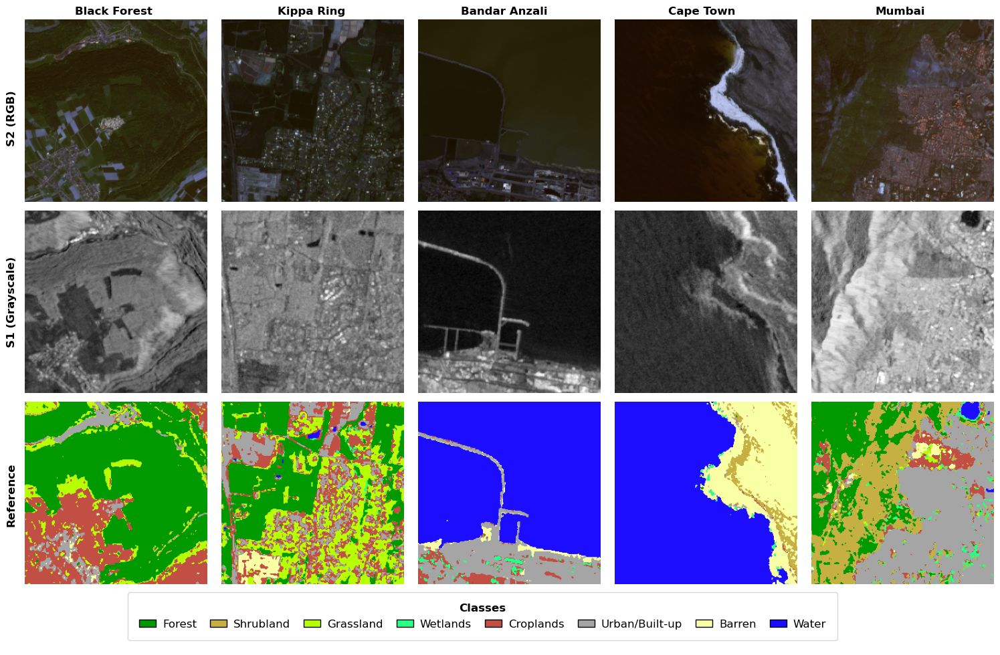
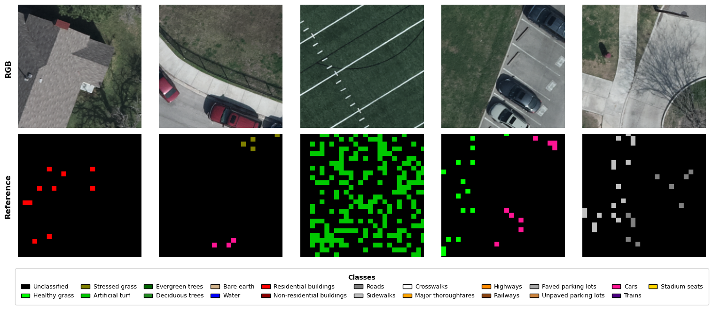
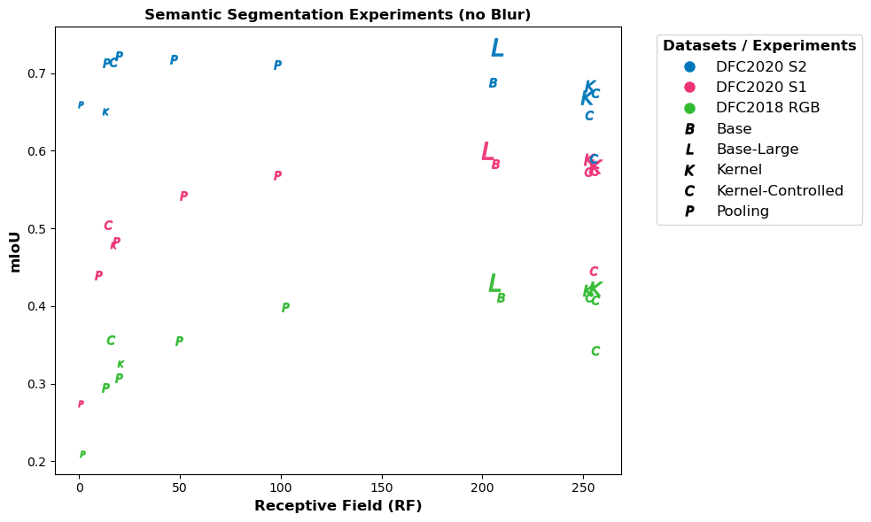

# The Role of Spatial Context in Deep Learning based Semantic Segmentation of Remote Sensing Imagery

## Introduction  
This project investigates the role of spatial context in semantic segmentation of remote sensing imagery. U-Net architectures are systematically modified to change their spatial modeling capacity, allowing analysis of how local and global context affect segmentation performance.  

While recent research often assumes that global context is crucial, these experiments show that its benefits are conditional rather than universal. Rich per-pixel and local information consistently drive performance, while broader context provides benefits mainly when data is noisy, information-poor, or when specific classes require larger spatial cues.


## Setup

This project was implemented with Python 3.12 and the packages are listed below. Two options are provided for installing dependencies:

### 1. Using pip

It is recommended to create a virtual environment.

On Windows:
```bash
python -m venv spatial_context_env
spatial_context_env\Scripts\activate
```
On macOS/Linux: 
```bash
python -m venv spatial_context_env
source spatial_context_env/bin/activate
```

Then install all dependencies:
```bash
pip install -r requirements.txt
```

### 2. Using conda
Create and activate the environment:

```bash
conda env create -f environment.yml
conda activate spatial_context_env
```

## Data  

The experiments use two publicly available datasets: DFC2020 (multispectral + SAR) and DFC2018 (used RGB only).  

1. **DFC2020**  
   - Download from [DFC2020](https://ieee-dataport.org/competitions/2020-ieee-grss-data-fusion-contest).  
   - Extract and move the four ROI subfolders (`ROIs0000_autumn`, `ROIs0001_spring`, `ROIs0002_summer`, `ROIs0003_winter`) into `dfc20/data/`.  
   - Prepare the data by running `dfc20/split.ipynb` and `dfc20/statistics.ipynb`.  

     
   *Sample test patches from the DFC2020 dataset.*

2. **DFC2018**  
   - Download from [DFC2018](https://web.archive.org/web/20200501012347/http://dase.grss-ieee.org).  
   - Extract and move `TrainingGT`, `Final RGB HR Imagery`, and `TestingGT` into `dfc18/data/`.  
   - Prepare the data by running `dfc18/data_setup.ipynb` and `dfc18/statistics.ipynb`.  

     
   *Sample test patches from the DFC2018 dataset after cropping*

## Training  

Segmentation experiments are run via:  

- `train_segmentation.ipynb` – main experiments (DFC2020 + DFC2018)  
- `train_majority.ipynb` – majority-class baseline (DFC2020 only)  

Hyperparameters and sensor modality are set in the **(TUNED) PARAMETERS** section, and the model architecture is chosen in the **MODEL CHOICE** section. Available models are in the `models` folder inside each dataset directory.  

## Visualization  

All visuals included in the thesis are available in the `visualizations` folder.
Image patches and model predictions can be explored using `visualize.ipynb`.  
Class distributions are visualized using `dfc20/split.ipynb` (DFC2020) and `dfc18/data_setup.ipynb` (DFC2018).  
A combined summary graphic of the segmentation experiments is generated in `visualizations/combined_results/visualize_all_results.ipynb`:

  
*Results across segmentation experiments.Performance (mIoU) is plotted against the theoretical
receptive field size (RF). Markers indicate the experiment type, with their size
scaled non-linearly by model size ranges. A small random jitter is applied to the
x-axis to improve readability and reduce overlap.*

